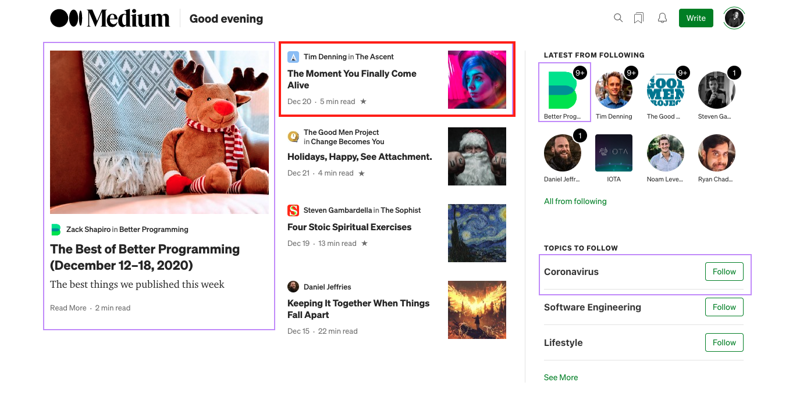
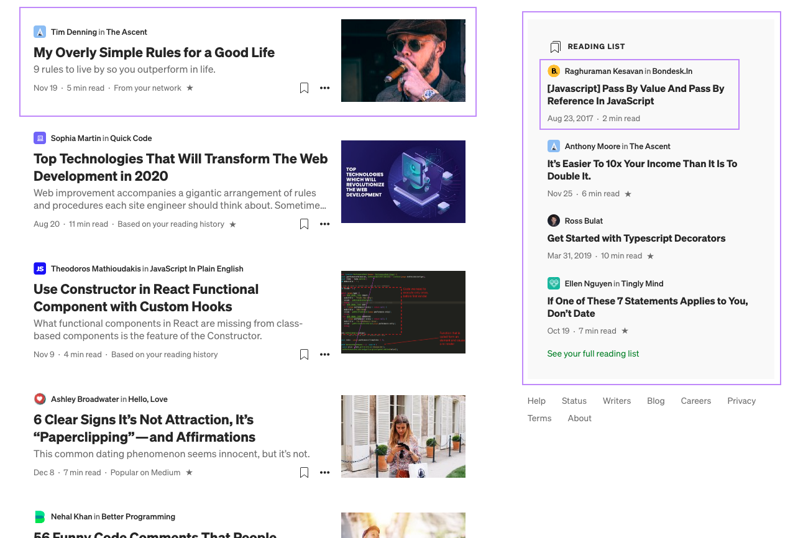
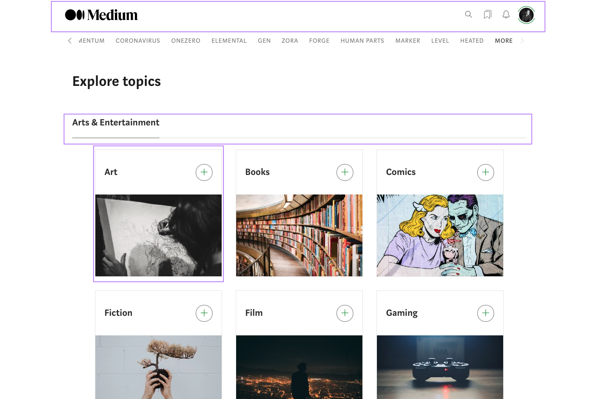
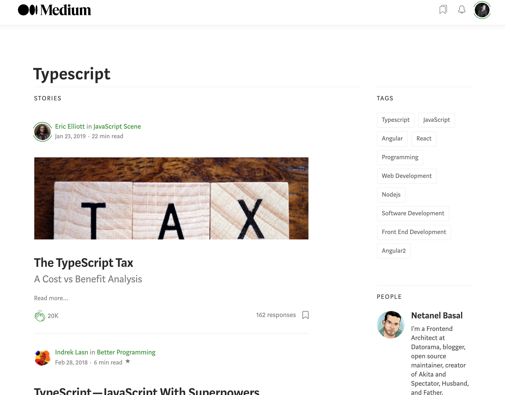
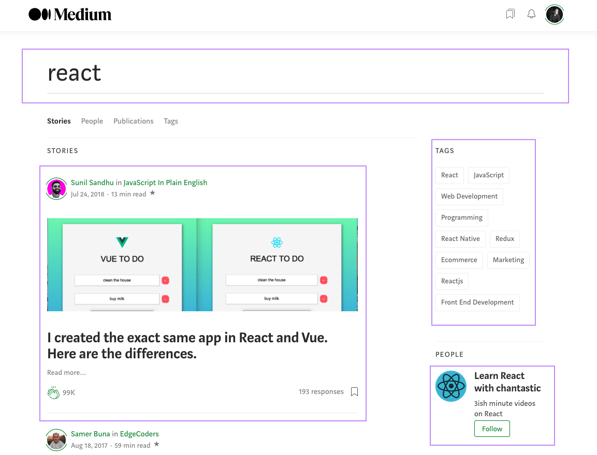
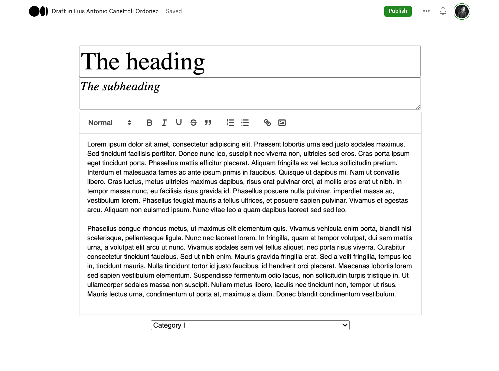
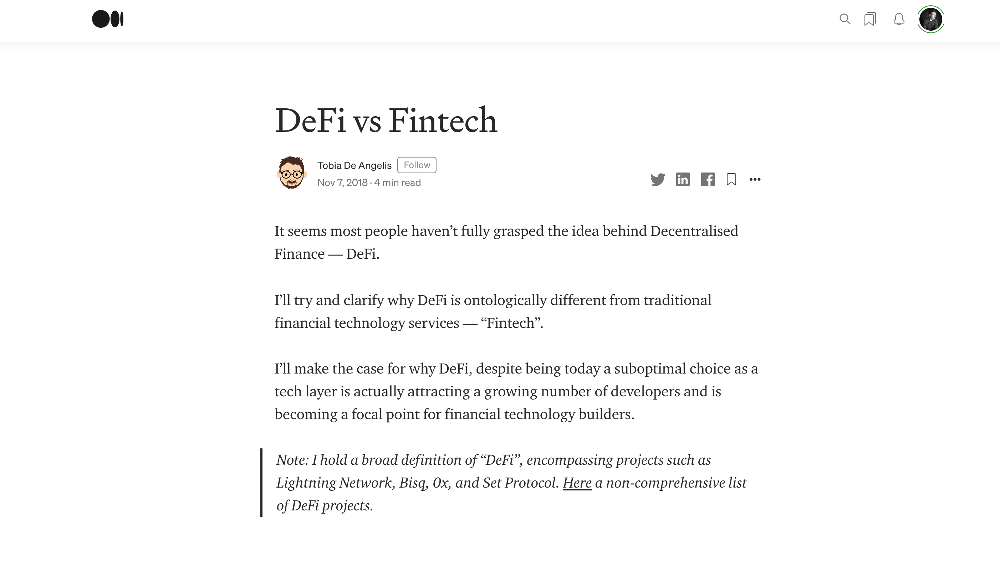

# Medium-FE-HW

### FRONTEND

## Homepage
Create *reusable components* for the homepage of this Medium clone, as highlighted in the following screenshots.

The red-lined elements have to be **the same component with different props**.

You will retrieve the latest articles from the endpoint and display them like this:




### Latest from following
This is the endpoint to call for a list of users with images:

```
https://strive-homeworks.herokuapp.com/api/users/public
```

*Hint: to retrieve the latest articles, you don't need a specific endpoint; you may just specify the order in the query and limit it*


## Topics

Create a page to choose which topics to check out.



When you click on a topic, you will see a page displaying a list of articles about the selected topic:



## Search

Create a search page to look for a specific article.
This needs a search bar and results, just like the "Topics" result list **(do reuse the components!)**




## Editor

Create an editor using [React Quill](https://www.npmjs.com/package/react-quill).
**Good luck!**



*Just for demonstration purposes, feel free to style this a little better*

The **Publish** button will contact the endpoint to POST the article, passing the raw HTML from React-Quill.
**Check the documentation!**

## Article page

You can use the [dangerouslySetInnerHTML](https://reactjs.org/docs/dom-elements.html#dangerouslysetinnerhtml) to set the HTML coming from your endpoint.




