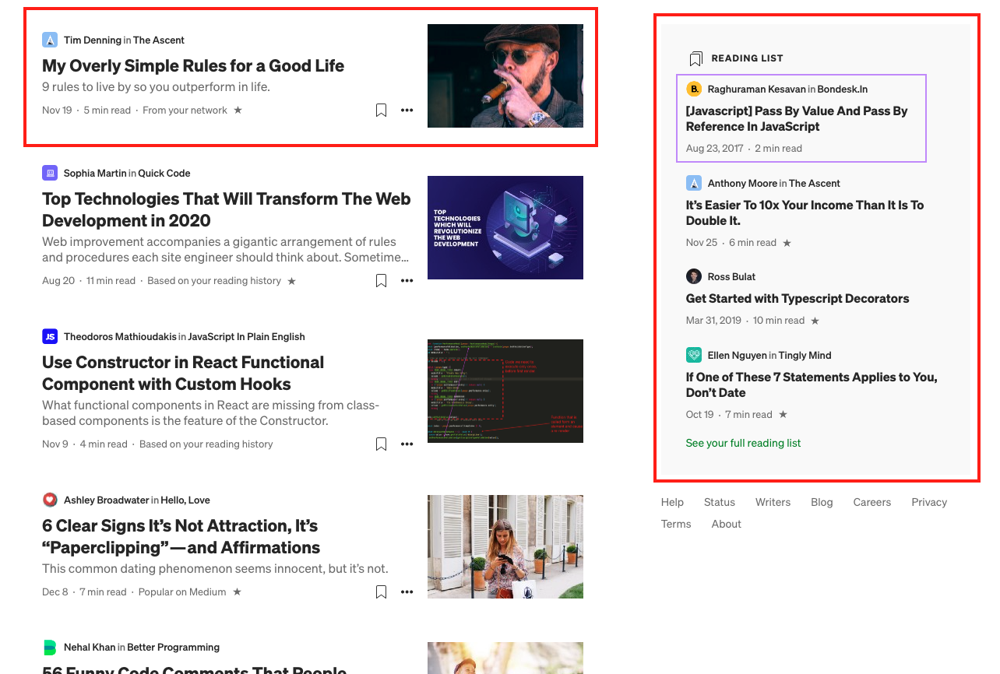

# Medium-FE-HW

### FRONTEND

## Homepage
Create *reusable components* for the homepage of this Medium clone, as highlighted in the following screenshots.
The red-lined elements have to be *the same component with different props*.
You will retrieve the latest articles from the endpoint and display them like this:


### Latest from following
This is the endpoint to call for a list of users with images:
```
theendpoint.www
```



*Hint: to retrieve the latest articles, you don't need a specific endpoint; you may just specify the order in the query and limit it*


## Topics

Create a page to choose which topics to check out.


When you click on a topic, you will see a page displaying a list of articles about the selected topic:


## Search

Create a search page to look for a specific article.
This needs a search bar and results, just like the "Topics" result list **(do reuse the components!)**


